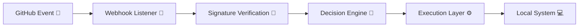
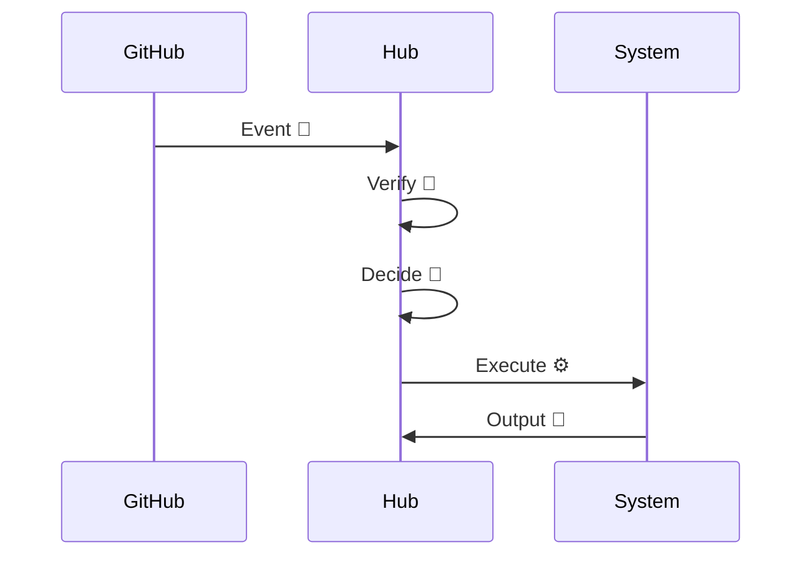

[](https://github.com/ruhdevops/System-Automation-Hub/actions/workflows/powershell-ci.yml)


[](https://github.com/ruhdevops/System-Automation-Hub/actions/workflows/jekyll-gh-pages.yml)


# ⚙️ 𝙎𝙮𝙨𝙩𝙚𝙢 𝘼𝙪𝙩𝙤𝙢𝙖𝙩𝙞𝙤𝙣 𝙃𝙪𝙗

### 🚀 *Your Event-Driven Machine Control Plane*

> **「 GitHub events aren’t notifications — they’re executable intent. 」**

---

## 🌌 𝙊𝙫𝙚𝙧𝙫𝙞𝙚𝙬

**System Automation Hub** is a **local-first, event-driven control system**
that transforms GitHub into a **secure command interface for real machines**.

```
Listen → Verify → Decide → Execute ⚡
```

No fluff.
No abstraction leaks.
Just **deterministic automation wired directly into your system layer**.

---

## 🎯 𝙑𝙞𝙨𝙞𝙤𝙣

> *Turn GitHub into a trusted, real-time control surface for local infrastructure.*

This is not a demo.
This is **living infrastructure**:

* 🔐 **Security-first by default**
* ⚙️ **Explicit execution paths**
* 🧠 **Composable control logic**
* 🧩 **Modular system growth**

---

## 🧬 𝘾𝙤𝙧𝙚 𝘼𝙧𝙘𝙝𝙞𝙩𝙚𝙘𝙩𝙪𝙧𝙚



---

## 🧱 𝘾𝙤𝙧𝙚 𝙋𝙧𝙞𝙣𝙘𝙞𝙥𝙡𝙚𝙨

### 🟢 **Local-First Execution**

> Runs where the metal lives — *zero unnecessary indirection*

---

### 🟡 **Event = Action**

> Pushes, merges, labels → **not signals — commands**

---

### 🔴 **Security is Law**

```
✔ HMAC-SHA256 validation
✔ Explicit trust boundaries
✔ Zero blind execution
```

---

### 🔵 **Modularity Over Magic**

* One module → one responsibility
* Inputs/outputs are explicit
* No hidden behavior

---

### 🟣 **Future-Native Design**

```
Containers 🐳
GPUs ⚡
Orchestration 🧩
```

---

## 🧠 𝘾𝙖𝙥𝙖𝙗𝙞𝙡𝙞𝙩𝙞𝙚𝙨

| Status | Feature                        | Description                          |
| :----: | ------------------------------ | ------------------------------------ |
|    ✅   | 🔐 **Secure Webhook Listener** | HMAC-SHA256 validation               |
|    ✅   | ⚙️ **PowerShell Engine**       | Native Windows execution runtime     |
|    ✅   | 🌐 **Local Endpoint**          | Dedicated localhost control          |
|    ✅   | 🌍 **Public Tunnel**           | ngrok (Cloudflare/Tailscale planned) |
|    ✅   | 🔁 **Event → Action**          | GitHub-triggered automation          |
|   🟡   | 🐳 **Containers**              | Docker / WSL expansion               |
|   🟡   | 📊 **Orchestration**           | Prefect / workflow engine            |
|   🟡   | ⚡ **GPU Queue**                | ML / compute routing                 |
|   🟡   | 🤖 **Self-hosted Runner**      | Repo controls itself                 |
|   🟡   | 🛡️ **Policy Engine**          | Rule-based execution                 |

---

## ⚡ 𝙀𝙭𝙚𝙘𝙪𝙩𝙞𝙤𝙣 𝙁𝙡𝙤𝙬



---

## 🧪 𝙋𝙝𝙞𝙡𝙤𝙨𝙤𝙥𝙝𝙮

```
GitHub   → Intent Layer
System   → Execution Authority
Hub      → Trusted Mediator
```

---

## 🛠️ 𝙏𝙚𝙘𝙝 𝙎𝙩𝙖𝙘𝙠

* 🧠 PowerShell → execution core
* 🌐 HTTP listener → control endpoint
* 🔐 HMAC → trust verification
* 🌍 ngrok → external access
* 🐍 Python → extensibility layer

---

## 🔮 𝙍𝙤𝙖𝙙𝙢𝙖𝙥

```
[✓] Pluggable execution backends
[✓] Policy-as-code (OPA style)
[✓] Intelligent routing (CPU/GPU)
[✓] Observability pipeline
[✓] Full self-hosted loop
```

---

## 👤 𝙈𝙖𝙞𝙣𝙩𝙖𝙞𝙣𝙚𝙧

**Ruh-Al-Tarikh**
🧠 Systems automation
⚙️ Infrastructure experimentation
🔥 Chaos engineering (controlled… mostly)

---

## 💡 𝙁𝙞𝙣𝙖𝙡 𝙉𝙤𝙩𝙚

> This isn’t automation for convenience.
> This is **control — defined precisely and executed intentionally.**

---

✨ *Build systems that listen. Verify everything. Execute with intent.*
